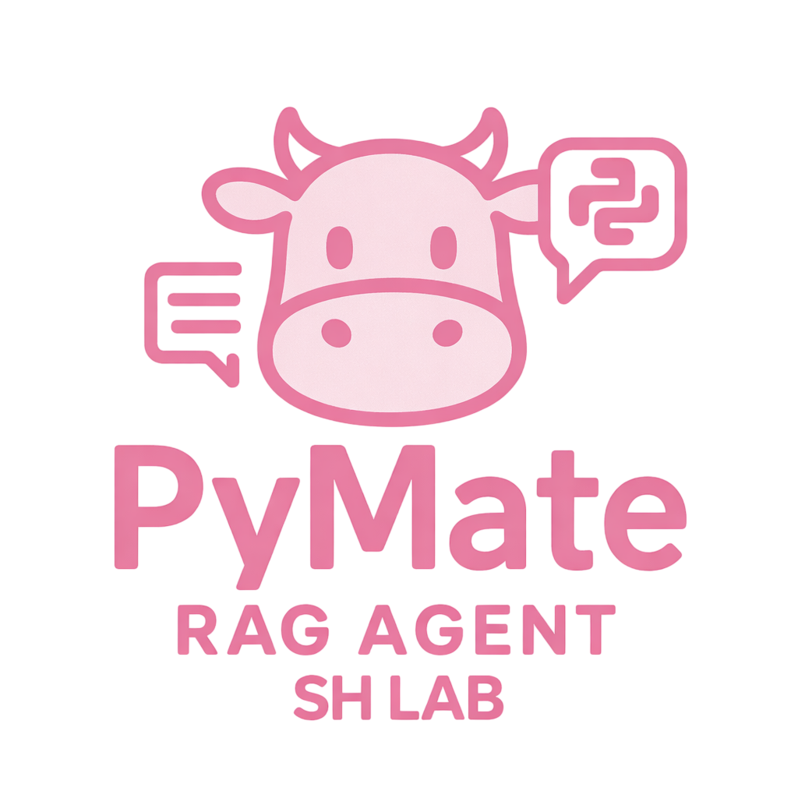
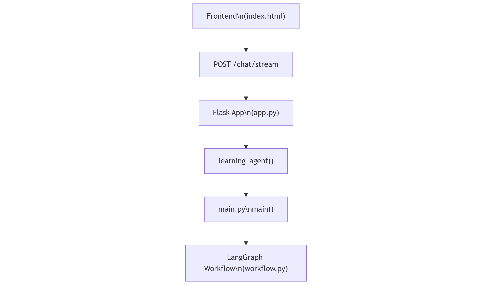
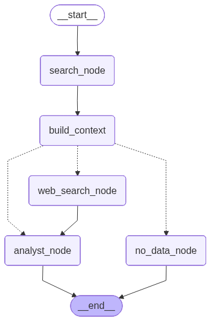
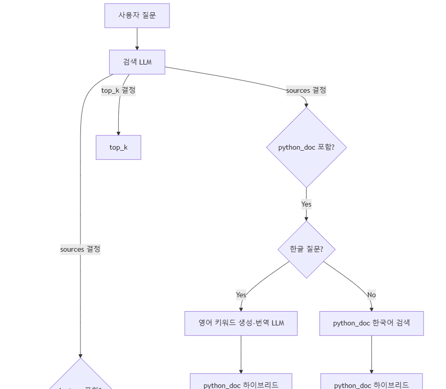
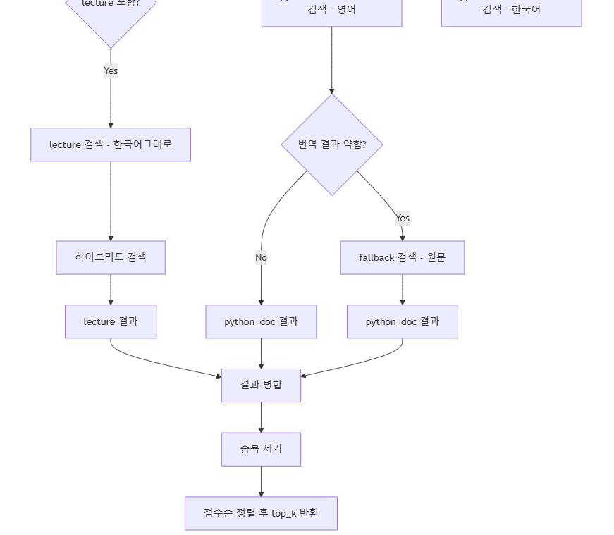
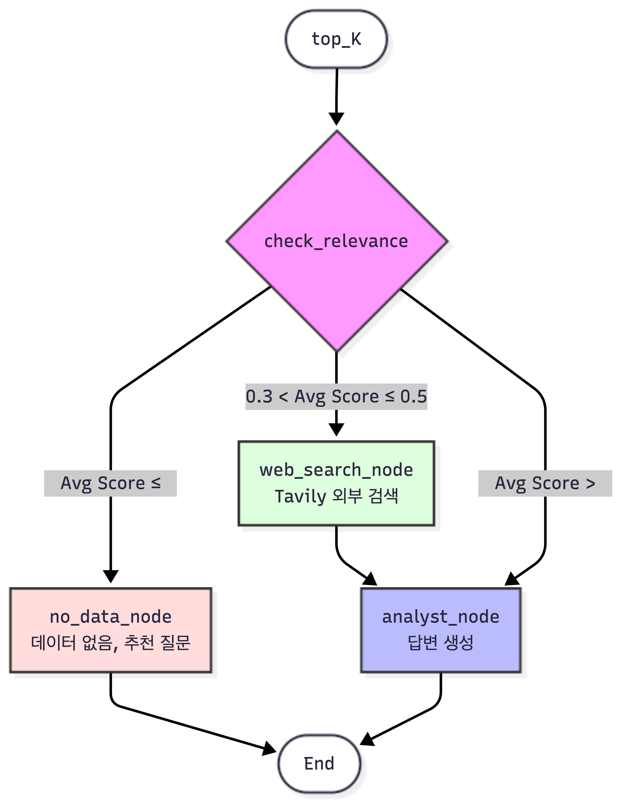

<div align="center">
  


<p align="center">
  
</p>

</div>


<br><br>


## 팀원 및 담당 업무
### SKN21_3rd_3Team
          
<table>
<tr>

<!-- 김가람 -->
<td align="center" width="200" style="vertical-align: top; padding: 15px;">
  
  <h3 style="margin: 10px 0 5px 0;">김가람</h3>
  <p style="margin: 5px 0;">LLM Reasoning Agent Developer</p>
  <a href="https://github.com/gr-kim-94">
    
  </a>
</td>

<!-- 최자슈아주원 -->
<td align="center" width="200" style="vertical-align: top; padding: 15px;">
  
  <h3 style="margin: 10px 0 5px 0;">최자슈아주원</h3>
  <p style="margin: 5px 0;">Retrieval Agent Engineer</p>
  <a href="https://github.com/reasonableplan">
    
  </a>
</td>

<!-- 윤경은 -->
<td align="center" width="200" style="vertical-align: top; padding: 15px;">
  
  <h3 style="margin: 10px 0 5px 0;">윤경은</h3>
  <p style="margin: 5px 0;">Vector DB Engineer(lectures)</p>
  <a href="https://github.com/ykgstar37-lab">
    
  </a>
</td>

<!-- 안해빙 -->
<td align="center" width="200" style="vertical-align: top; padding: 15px;">
  
  <h3 style="margin: 10px 0 5px 0;">안혜빈</h3>
  <p style="margin: 5px 0;">LLM Reasoning Agent Developer</p>
  <a href="https://github.com/hyebinhy">
    
  </a>
</td>

<!-- 정세연 -->
<td align="center" width="200" style="vertical-align: top; padding: 15px;">
  
  <h3 style="margin: 10px 0 5px 0;">정세연</h3>
  <p style="margin: 5px 0;">Vector DB Engineer(python)</p>
  <a href="https://github.com/wjdtpdus25">
    
  </a>
</td>

<!-- 신지용 -->
<td align="center" width="200" style="vertical-align: top; padding: 15px;">
  
  <h3 style="margin: 10px 0 5px 0;">신지용</h3>
  <p style="margin: 5px 0;">Retrieval Agent Engineer</p>
  <a href="https://github.com/sjy361872">
    
  </a>
</td>

</tr>
</table>

<br><br>

## 프로젝트 주제 및 주제 설명 및 선정 이유

### 1. 주제 
> **개념·코드·실습 질문에 답변하는 RAG 기반 학습 지원 챗봇**

<br>

본 프로젝트는 **학습 자료 데이터(ipynb)** 와 **Python 공식 문서(Python 3 Documentation)** 를 
핵심 지식으로 활용하여 개념, 코드, 실습 질문에 답변할 수 있는
RAG(Retrieval-Augmented Generation) 기반 학습 도우미 챗봇을 개발하는 것을 목표로 한다.

수업에서 실제로 사용한 학습 자료를 중심으로 하되,
부족할 수 있는 언어 차원의 설명은 공식 문서로 보완하여
보다 정확하고 신뢰도 높은 학습 지원 환경을 제공한다.

<br>

### 2. 주제를 선택한 이유 
🔹 팀원 모두가 실제로 학습한 부트캠프 수업 자료를 그대로 활용 <br>

🔹 Markdown 설명 + Code 셀이 결합된 고품질 학습 데이터 <br>

🔹 Python 개념 및 문법 설명을 **공식 문서(Python Docs)** 로 보완하여 정확성 강화 <br>

🔹 “수업 범위 + 언어 공식 기준”이라는 명확한 질문 기준으로 학습 몰입도와 실용성 우수 <br>

🔹 RAG 구조(수집 → 임베딩 → 검색 → 생성)를 교육 관점에서 명확히 설명·구현·확장 가능한 주제 <br>

향후 Agent 확장 및 추가 데이터 소스 연계가 자연스러운 구조

<br>

### 3. 주요 기능
> 학습 자료 데이터를 기준으로 개념 설명, 코드 해석, 주제별 검색을 지원하는 RAG 학습 도우미

1️⃣ **개념 설명 질의응답** <br>
부트캠프 학습 자료와 Python 공식 문서를 기반으로 핵심 개념에 대한 질문에 정확한 답변을 제공한다.
- 예시 질문
  - “RAG가 뭐야?”
  - “Retriever의 역할이 뭐야?”
- 강의 자료의 설명을 우선적으로 활용하여 **수업 맥락에 맞는 답변**을 생성

2️⃣ **코드 역할 및 의도 설명** <br>
강의 자료 내 실습 코드 및 예제 코드를 대상으로 각 코드의 역할과 작성 의도를 자연어로 설명한다.
- 예시 질문
  - “이 코드에서 왜 이 부분이 필요한 거야?”
- 코드 셀과 연관된 Markdown 설명을 함께 참조하여 코드 중심 학습을 지원

3️⃣ **학습 범위 기반 응답 생성 (RAG 구조)**
- Retriever를 통해 관련 문서를 검색
- 검색된 문서를 기반으로 LLM이 답변 생성
- 수업 자료 및 공식 문서를 벗어나지 않는 **신뢰도 높은 응답** 제공

<br><br>

## Application의 주요 기능

<p align="center">
        
      </p>

<p align="center">
        
      </p>

## 프로젝트를 구성하는 디렉토리들과 파일들의 구조
</div>
<br>

```plaintext
SKN21_3rd_4Team
├── data/                          # RAG 학습 및 검색에 사용되는 데이터
│   ├── raw/                         # 원본 데이터 (강의 자료, 문서 등)
│   ├── query_enhancement/           # 질의 확장(Query Enhancement) 관련 데이터
│ 
├── docs/                          # 프로젝트 관련 문서 및 설명 자료
├── image/                         # README 및 UI에 사용되는 이미지 파일
├── notebooks/                     # 실험 및 분석용 Jupyter Notebook
├── results/                       # 검색 결과, 실험 결과 저장
├── scripts/                       # 실행용 스크립트 모음
│
├── src/                           # 핵심 소스 코드
│   ├── agent/                       # Search / Analysis Agent 로직
│   ├── schema/                      # 데이터 및 응답 스키마 정의
│   ├── utils/                       # 공통 유틸리티 함수
│   ├── ingestion.py                 # 데이터 수집 및 전처리 파이프라인
│   ├── ingestion_lectures.py        # 강의 자료(ipynb) 수집 및 임베딩
│   ├── ingestion_rst.py             # 문서(rst 등) 수집 및 임베딩
│   ├─ quiz_service.py               # 퀴즈 생성 및 관리 서비스 로직
│   └── vector_search.py             # Vector DB 기반 검색 로직
│
├── templates/                     # Flask 렌더링 템플릿
│
├── app.py                         # Flask 기반 웹 애플리케이션 진입점
├── main.py                        # 전체 파이프라인 실행 메인 파일
├── init_setting.py                # 초기 환경 및 설정 관리
│
├── intro.md                       # 프로젝트 소개 문서
├── README.md                      # 프로젝트 설명 문서
│
├── requirements.txt               # Python 패키지 의존성
├── pyproject.toml                 # 프로젝트 설정 및 빌드 정보
│
│
├── unit_test.ipynb                # 단위 테스트 및 기능 검증 노트북
└── utils.py                       # 보조 유틸리티 함수
```

원본 데이터(`/data/raw/`)의 경우, 최종 git에서 제거
<br>
<div> 

<br>


## Tech Stack
### Core Utilities & Environment


### LLM & RAG 


### Vector Database


### Backend / View


<br><br>

<br>

## 프로젝트 전체 흐름도

다음은 프론트엔드부터 백엔드, LangGraph 워크플로우까지의 전체 프로세스를 나타내는 흐름도:

<br>

<p align="center">
  
  
</p>


<br>

**주요 흐름:**
1. **Frontend (index.html)**: 사용자 인터페이스
2. **POST /chat/stream**: HTTP POST 요청
3. **Flask App (app.py)**: 백엔드 서버
4. **learning_agent()**: 에이전트 함수 호출
5. **main.py main()**: 메인 파이프라인 실행
6. **LangGraph Workflow**: 검색 및 분석 워크플로우 실행

<br>

## 수집 데이터 설명
- 강의 자료 데이터 (`.ipynb`)
  - Markdown 셀: 개념 설명, 이론 정리
  - Code 셀: 실습 코드, 예제 구현
#### 출처 [SKN21-inst](https://github.com/kgmyhGit/SKN21-inst)

- Python 공식 문서 (`Python 3 Documentation`)
  - Python 문법 및 표준 라이브러리 설명
  - 언어 차원의 개념, 함수, 동작 원리 보완
  - 공식 기준에 따른 정확한 설명 제공
#### 출처 [Python 3 Documentation](https://docs.python.org/ko/3/download.html)
<br>

▪️ 내부 학습 자료 + 공식 문서 결합으로 데이터 신뢰도 극대화 <br>
▪️ 외부 블로그·비공식 자료에 의존하지 않는 정제된 RAG 데이터 구성

<br><br>

## 강의 데이터(lecture) 전처리 및 임베딩

## 1️⃣ 강의 자료 (Jupyter Notebook)
본 프로젝트에서 활용한 강의 자료는  
**김성환 강사님의 강의 콘텐츠를 기반으로 한 학습 자료**이며,  
모든 저작권은 김성환 강사님께 있습니다. <br>

### 전처리 핵심 전략

- `.ipynb` 파일 파싱 (Markdown / Code 셀 분리)
- 이미지·HTML·불필요한 포맷 제거
- 의미 없는 셀(짧은 텍스트, 링크-only) 필터링
- 설명 → 코드 → 설명 구조 유지한 의미 단위 청킹
- 강의 주차·파일명 메타데이터 포함

### 결과

- 강의 흐름을 유지한 검색 친화적 벡터 데이터 생성
- "어느 강의의 어떤 내용인지" 추적 가능한 RAG 검색 구현

<br><br>

## 2️⃣ Python 공식 문서 (RST)

Python 공식 문서는 문법적 노이즈가 많아,
의미 밀도 극대화를 목표로 한 RST 특화 전처리를 적용하였다.

### 전처리 핵심 전략

- RST directive / role / index 등 문법 노이즈 제거
- 설명 텍스트는 정제, 코드 블록은 원형 보존
- API 시그니처·메서드 호출 정보 추출
- 문서 구조 기반 섹션 파싱 (TITLE / H1 / H2)
- 검색 강화를 위한 Context Prefix 자동 삽입


<br><br>


## Retrieval 실험 결과 (평균 유사도)

### Python Official Docs (RST) — Retrieval 실험 요약 (질문 11개)


| 단계 | 평균 유사도 | 개선율 | 핵심 변경 사항 |
|---|---:|---:|---|
| 전처리 전 (TXT) | **0.3500** | – | TXT 파일 기반 단순 벡터 검색(한글 질의) |
| 전처리 후 (RST, 초기) | **0.5587** | +59.6% | RST 파싱, chunk_size=900, 번역 프롬프트 적용 |
| 하이브리드 검색 (F) | **0.6360** | +13.8% | Vector + Keyword + BM25, `text-embedding-3-small` |
| 하이브리드 검색 (최종) | **0.7012** | +10.3% | Vector + Keyword + BM25, `text-embedding-3-large`, 프롬프트 개선 |

<br> 

### Lecture Notebook (ipynb) — Retrieval 실험 요약 (질문 10개)

| 단계 | 평균 유사도 | 개선율 | 설명 |
|---|---:|---:|---|
| 전처리 전 | **0.4500** | – | 전처리 없이 단순 벡터 검색(추정치) |
| 전처리 후 | **0.5285** | +17.4% | 노트북 파싱 및 기본 전처리 적용 |
| 하이브리드 검색 | **0.6701** | +26.8% | Vector + Keyword + BM25 |

<br>

### 전체 개선 성과 요약

- **Python Docs (질문 11개)**  
  **0.3500 → 0.7012** (총 개선율: **+100.4%**)  
  - **TXT → RST 전환 + 하이브리드 검색**이 가장 큰 성능 향상에 기여

- **Lecture (질문 10개)**  
  **0.4500 → 0.6701** (총 개선율: **+48.9%**)  
  - **전처리 + 하이브리드 검색 조합**의 효과 확인


<br><br>


## 하이브리드 검색 (Vector + Keyword + BM25)

본 프로젝트는 검색 품질 향상을 위해 **하이브리드 검색** 방식을 채택했습니다.

### 목표
- **강의 노트(lecture)** + **Python 공식문서(python_doc, RST)** 를 동시에 활용하는 RAG에서 검색 품질 향상

### 핵심 아이디어
하이브리드 검색은 Qdrant 벡터 검색 결과에 대해 세 가지 점수를 **가중합**으로 결합하여 최종 점수를 계산합니다:

- **Vector score** (의미 유사도): 임베딩 벡터 간 코사인 유사도
- **Keyword matching** (정확 용어 포함 여부): 질문의 키워드가 문서에 포함되어 있는지 확인
- **BM25** (Best Matching 25): 키워드 빈도/문서 길이 기반 점수

### 동적 가중치
쿼리 유형에 따라 가중치를 자동 조정합니다:

- **일반 쿼리**: Vector 0.6 / Keyword 0.2 / BM25 0.2
- **단일 단어 쿼리**: Vector 0.4 / Keyword 0.3 / BM25 0.3 (정확 용어 매칭 강화)

### 검색 방식 상세

**1. 후보 확장 (candidate_k)**
- 벡터 검색만으로는 정확한 키워드를 포함한 문서를 놓칠 수 있음
- 벡터 단계에서 후보를 넉넉히 확보 (예: `candidate_k = top_k * 4~6`)
- 그 후보들을 하이브리드 점수로 재정렬하여 최종 `top_k` 반환
- → **Recall과 정확도 동시 개선**

**2. 키워드 매칭 (Keyword Matching)**
- 질문에서 키워드 추출 (공백 기준, 2글자 이상)
- 각 문서에서 키워드 포함 여부 확인
  - 정확한 단어 매칭 (우선순위 높음)
  - 부분 문자열 매칭 (예: "trimming"이 "trimming_history"에 포함)
- 매칭된 키워드 비율로 점수 계산 (0.0 ~ 1.0)

**3. BM25 (Best Matching 25)**
- **TF (Term Frequency)**: 키워드가 문서에 나타나는 빈도
- **IDF (Inverse Document Frequency)**: 키워드가 드물수록 높은 점수
- **문서 길이 정규화**: 긴 문서는 불리하지 않도록 정규화
- 세 가지를 결합하여 최종 점수 계산

**4. 듀얼 쿼리 + Fallback (python_doc 최적화)**
- Python 공식 문서는 영어이므로 한글 질문의 경우 **영어 키워드 검색**을 기본으로 사용
- 번역 결과가 약하면 (최고 점수 < 0.45) **한글 원문으로 fallback 검색** 추가
- 안전장치 확보로 검색 품질 보장

### 검색 과정 흐름도

다음은 전체 검색 프로세스를 나타내는 흐름도입니다:

<br>

<div align="center">
  
</div>
<div align="center">
  
</div>

<br>

<p align="center">
  
</p>

<br>

**흐름도 주요 단계:**
1. **사용자 질문** → **검색 LLM**에서 질문 분석 및 검색 파라미터 결정
2. **top_k 결정**: 검색할 결과 개수 결정 (기본=3, 중급=5, 고급=7)
3. **sources 결정**: 검색할 소스 결정 (`lecture`, `python_doc`)
4. **소스별 검색**:
   - **lecture**: 한글 원문으로 직접 하이브리드 검색
   - **python_doc**: 한글 질문일 경우 영어 키워드로 번역 후 검색 (번역 결과가 약하면 fallback)
5. **결과 병합 및 중복 제거**: 여러 소스에서 가져온 결과 통합
6. **점수순 정렬 후 top_k 반환**: 하이브리드 점수 기준으로 정렬하여 최종 결과 반환

<br><br>

## 평가 결과
### RAGAS
TestsetGenerator를 통해 생성된 테스트셋 20개를 가지고 평가한 결과로 평가 진행

| Context Recall | Context Precision | Faithfulness | Answer relevancy | 
|-----------|-----------|-----------|-----------|
| 0.8583 | 0.8494 | 0.8542 | 0.8352 | 

<br><br>

## 회고

| 이름 | 역할 | 소감 |
|-----------|-----------|-----------|
| **대가람** | LLM Reasoning Agent Developer |   |
| **지드래곤** | Search & Retrieval Agent Developer |   |
| **좌슈아주원** | Search & Retrieval Agent Developer |  |
| **윤경은** | Lecture Data Ingestion Engineer |  |
| **앙해빙** | LLM Reasoning Agent Developere |    |
| **세여닝** | Text Data Vectorization Engineer |    |

