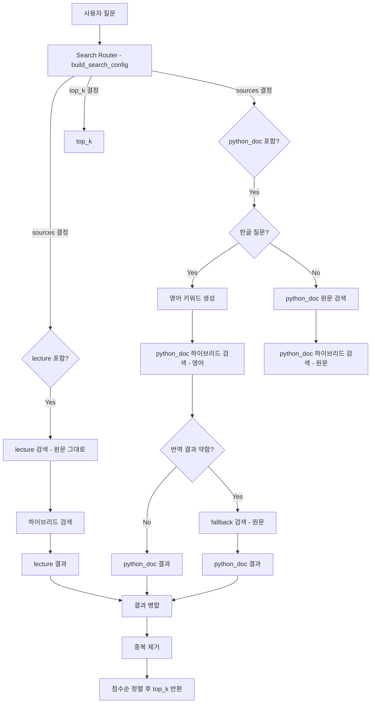

## Retrieval Agent (Search & Retrieval) — README용

### 담당 역할 한 줄 요약
- **Retrieval Agent Engineer**로서, *사용자 질문을 분석 → 최적 검색 소스/개수 결정 → (필요 시) 한글→영어 키워드 변환 → Qdrant에서 하이브리드(벡터+키워드+BM25) 검색 → 결과 통합/정렬*까지의 **검색 파이프라인**을 구현/개선했습니다.

---

### 내가 담당한 핵심 기여 (What I did)
- **검색 라우팅(Router) 기반 설정 결정**: 질문 유형/난이도에 따라 `top_k`, `sources(lecture/python_doc)`를 자동 결정.
- **듀얼 쿼리 검색(Dual Query)**: Python 공식문서(RST)가 영어 기반이라, 한글 질문일 때 **영어 키워드 검색을 기본**으로 수행하고 필요 시 원문 fallback.
- **하이브리드 검색(벡터 + 키워드 매칭 + BM25)**: 벡터 유사도만으로 놓칠 수 있는 “정확한 용어/토큰”을 키워드/BM25로 보완하고 재랭킹.
- **top_k 후보 확장(candidate_k)**: 벡터 검색 단계에서 후보를 넉넉히 가져온 뒤 하이브리드 점수로 재정렬하여 recall 향상.
- **문서 전처리/인제스트 품질 향상 포인트 반영**: RST 문서의 RST 노이즈 제거 + API/키워드/제목 프리픽스 주입, 강의노트는 마크다운/코드 정제 + 문맥 프리픽스 주입.

---

### 담당 파일 & 책임 범위 (Ownership)
| 파일 | 역할 | 핵심 포인트 |
|------|------|------------|
| `src/agent/nodes/search_agent.py` | **Retrieval Agent 메인 로직** | 듀얼쿼리 + 하이브리드 검색 + 소스별 검색 + 결과 통합/중복제거/정렬 |
| `src/agent/prompts/search_prompt.py` | **Search Router 프롬프트** | 질문 유효성/유형/난이도/검색소스/`top_k` 결정 기준 정의 |
| `src/agent/prompts/translate_prompt.py` | **번역(=검색용 영어 키워드 생성) 프롬프트** | “번역”이 아니라 *Python Docs에 잘 걸리는 키워드* 생성(최소 키워드 수 보장, 핵심 개념 필수 키워드 매핑) |
| `src/ingestion_rst.py` | **Python 공식문서(RST) 인제스트/전처리** | RST 노이즈 제거, 섹션 파싱, chunking, `[API]/[KEYWORDS]/[TITLE]/[H1]/[H2]` 프리픽스 주입 |
| `src/ingestion_lectures.py` | **강의노트(ipynb) 인제스트/전처리** | 마크다운/코드 정제, 너무 짧은 셀 제거, `[강의]/[섹션]` 문맥 프리픽스 주입 |

---

### 전체 흐름도 (End-to-End Flow)

---

### Retrieval Agent 동작 상세 (핵심 로직)

#### 1) Search Router로 검색 설정 자동 결정 (`search_prompt.py`)
- 질문을 분석해서 아래를 결정:
  - **is_valid**: 학습/개념 질문인지(노이즈/일상 대화는 차단)
  - **sources**: `lecture` / `python_doc` / 둘 다
  - **top_k**: 난이도에 따라 3/5/7
  - **topic_keywords**: 핵심 키워드(후속 키워드 기반 점수 계산에 활용)

#### 2) python_doc는 “영어 키워드 검색”이 기본 (`translate_prompt.py`)
- Python 공식문서는 대부분 영어이므로 한글 질문을 그대로 벡터화하면 매칭이 약해질 수 있음
- 그래서 번역 프롬프트는 **문장 번역이 아니라 “검색용 영어 키워드 생성기”**로 설계:
  - 최소 4개 키워드 보장
  - “상속 → method resolution order(MRO)” 같은 **필수 키워드 매핑**으로 정확도/재현율 개선

#### 3) 하이브리드 검색: 벡터 + 키워드 매칭 + BM25 (`search_agent.py`)
- **벡터 검색(Qdrant)**: `OpenAIEmbeddings.embed_query(query)`로 쿼리 벡터 생성 후 `client.query_points(...)`로 후보를 가져옴
- **키워드 매칭 점수**: 쿼리 키워드가 문서 텍스트에 얼마나 등장하는지(정확/부분 매칭 가중치 포함) 

키워드 매칭 점수 = 매칭된 키워드 가중치 합 / 전체 키워드 가중치 합

- **BM25 점수**: 키워드 기반 sparse 점수(문서 길이 정규화 포함, 간단 IDF 근사)

1. **TF (Term Frequency)**: 키워드가 문서에 나타나는 빈도
2. **IDF (Inverse Document Frequency)**: 키워드가 드물수록 높은 점수
3. **문서 길이 정규화**: 긴 문서는 불리하지 않도록 정규화
4. 세 가지를 결합하여 최종 점수 계산

- **최종 점수(가중합)**:
  - 일반 쿼리: vector 0.6 / keyword 0.2 / bm25 0.2
  - 단일 단어: vector 0.4 / keyword 0.3 / bm25 0.3 (정확 용어 매칭 강화)

#### 4) top_k 후보 확장(candidate_k)을 하는 이유
- 하이브리드는 **벡터 상위 결과만** 보면 “정확한 토큰/용어”가 포함된 문서를 놓칠 수 있음  
  → 그래서 벡터 단계에서 `candidate_k`(예: `top_k*4~6`)를 먼저 가져오고,
  → 키워드/BM25 포함한 **하이브리드 점수로 재정렬**해서 최종 `top_k`를 반환합니다.

---

### Ingestion(적재) 측면에서 검색 품질을 위해 적용한 포인트

#### `ingestion_rst.py` (python_doc)
- RST 노이즈 제거(불필요한 directive/장식 등)로 임베딩 품질 개선
- 섹션 파싱 후 chunking (chunk_size=900, overlap=200)
- 모든 chunk에 프리픽스 주입:
  - `[API] ...` / `[KEYWORDS] ...` / `[TITLE] ...` / `[H1] ...` / `[H2] ...`
  - 검색 시 “정확한 용어”가 상단에 노출되어 **키워드/BM25/벡터 모두**에 유리

#### `ingestion_lectures.py` (lecture)
- 마크다운: 이미지/URL/HTML/LaTeX/헤더 기호 등 노이즈 제거
- 너무 짧은 셀/링크만 있는 셀 제거(검색에 도움 없는 텍스트 제거)
- 강의 제목/섹션 문맥 프리픽스 주입:
  - `[강의: ...]`, `[섹션: H1 > H2 > H3]`

---

###  “Retrieval Agent의 가치” 한 문장
- **한국어 사용자 질문을 “강의 노트(한국어) + Python 공식문서(영어)” 두 지식원에서 동시에 정확히 회수**하기 위해, 라우팅/번역키워드/하이브리드 재랭킹/전처리 프리픽스까지 포함한 **검색 중심 파이프라인**을 구축했습니다.

