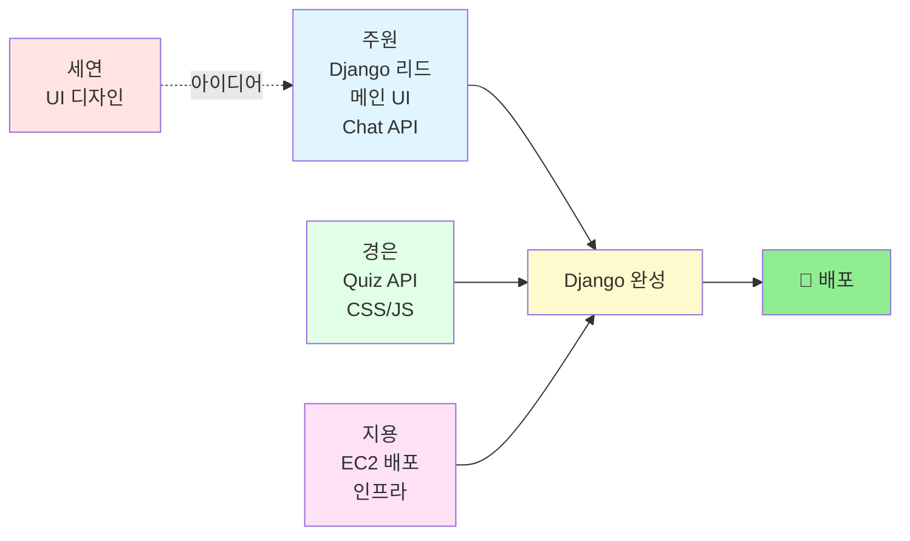
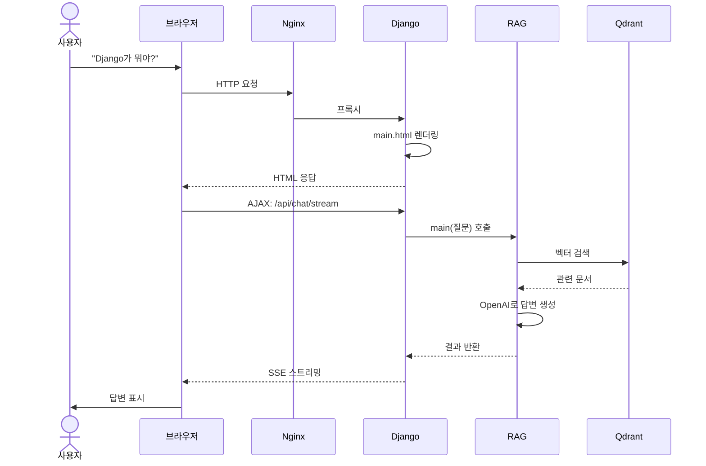

# 🎯 프로젝트 아키텍처 한눈에 보기

> **목표:** Flask 앱 → Django 변환 → EC2 배포

---

## 📊 전체 구조 (5초 요약)

```
┌─────────────┐
│ 👤 사용자    │
└──────┬──────┘
       │ 브라우저로 접속
       ▼
┌─────────────────────────────────────┐
│        AWS EC2 서버 (클라우드)       │
│  ┌─────────────────────────────┐   │
│  │  🐳 Docker 컨테이너들       │   │
│  │                              │   │
│  │  ┌────────────────────────┐ │   │
│  │  │ Nginx (웹 서버)        │ │   │
│  │  └───────┬────────────────┘ │   │
│  │          │                   │   │
│  │  ┌───────▼────────────────┐ │   │
│  │  │ Django (백엔드/프론트) │ │   │
│  │  │  - main.html (메인)    │ │   │
│  │  │  - Chat API           │ │   │
│  │  │  - Quiz API           │ │   │
│  │  └───────┬────────────────┘ │   │
│  │          │ main() 호출      │   │
│  │  ┌───────▼────────────────┐ │   │
│  │  │ RAG 시스템 (완성됨)    │ │   │
│  │  └───────┬────────────────┘ │   │
│  │          │ 벡터 검색        │   │
│  │  ┌───────▼────────────────┐ │   │
│  │  │ Qdrant (벡터 DB)       │ │   │
│  │  └────────────────────────┘ │   │
│  └─────────────────────────────┘   │
└─────────────────────────────────────┘
```

---

## 👥 팀 역할 분담



**핵심:**
- **세연** = 디자인 아이디어만 (개발 X)
- **주원** = Django + 메인 UI + Chat API
- **경은** = Quiz API + CSS/JS(**간소화!**)
- **지용** = EC2 배포 + 정적 파일 설정

---

## 🔄 작업 흐름 (사용자가 질문하면?)



---

## 📁 파일 구조 (간소화 버전)

```
SKN21_3rd_4Team/
│
├── 🆕 django_app/          ← 주원·경은·지용이 새로 만듦
│   ├── manage.py
│   │
│   ├── config/             ← 주원
│   │   ├── settings.py
│   │   ├── urls.py
│   │   └── middleware.py   ← 경은 (에러 핸들링)
│   │
│   ├── apps/
│   │   ├── chat/           ← 주원 (Chat API)
│   │   └── quiz/           ← 경은 (Quiz API)
│   │
│   ├── templates/          ← 2개만!
│   │   ├── base.html       ← 주원
│   │   └── main.html       ← 주원 (세연 디자인 참고)
│   │
│   └── static/             ← 간소화!
│       ├── css/
│       │   ├── base.css    ← 경은
│       │   └── main.css    ← 경은
│       ├── js/
│       │   ├── chat.js     ← 경은
│       │   └── quiz.js     ← 경은
│       └── images/
│
├── ✅ main.py              ← 완성됨 (건드리지 말 것!)
├── ✅ src/                 ← 완성됨 (RAG 시스템)
├── ✅ data/                ← 완성됨 (강의 자료)
│
├── ✅ deploy/              ← 지용 (완료)
│   ├── Dockerfile
│   ├── docker-compose.yml
│   └── nginx.conf
│
└── ❌ app.py               ← Flask (Django로 대체)
    └── templates/index.html  ← 2177줄 (분할 예정)
```

---

## 🎨 지금 할 일 (우선순위)

### 1단계: Django 프로젝트 생성 (주원)
```bash
cd SKN21_3rd_4Team
django-admin startproject config django_app
cd django_app
python manage.py startapp chat
python manage.py startapp quiz
```

### 2단계: UI 분할 (주원 + 경은)
- **주원**: `index.html` → `base.html` + `main.html`
- **경은**: CSS 추출 → `base.css` + `main.css` (2개만!)
- **경은**: JS 추출 → `chat.js` + `quiz.js`

### 3단계: API 이관 (주원 + 경은)
- **주원**: Chat API (SSE 스트리밍)
- **경은**: Quiz API

### 4단계: 배포 (지용)
```bash
cd deploy
docker-compose up -d
```

---

## ⚡ 핵심 포인트

### ✅ DO (해야 할 것)
- Django에서 `from main import main` 호출
- Flask `app.py` 로직을 Django로 복사
- API 경로 동일하게 유지
- CSS/JS를 `static/` 폴더로 분리

### ❌ DON'T (하지 말 것)
- `main.py`, `src/` 폴더 **절대 수정 금지**
- API 응답 형식 변경 금지
- 불필요한 기능 추가 금지 (간소화!)

---

## 🚀 완성되면?

```
http://<EC2_IP>/

→ Django가 main.html 렌더링
→ JavaScript가 /api/chat/ 호출
→ Django가 main() 호출
→ RAG 시스템이 답변 생성
→ 브라우저에 스트리밍 응답

✨ 완성! ✨
```

---

## 🆚 간소화 요약

| 항목          | 이전 계획 | 최종 (간소화)          |
| ------------- | --------- | ---------------------- |
| **템플릿**    | 3개       | ✅ **2개** (base, main) |
| **CSS**       | 3개       | ✅ **2개** (base, main) |
| **JS**        | 2개       | ✅ 2개 (chat, quiz)     |
| **도움 UI**   | 포함      | ❌ **제거**             |
| **Health**    | API 포함  | ❌ **제거**             |
| **경은 작업** | 많음      | ✅ **간소화!**          |

---

> **간소화 이유:** 3일 프로젝트 → 핵심 기능(Chat+Quiz)에만 집중!
