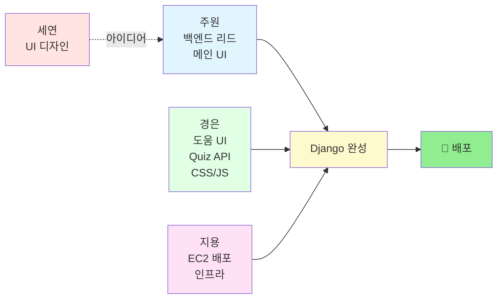
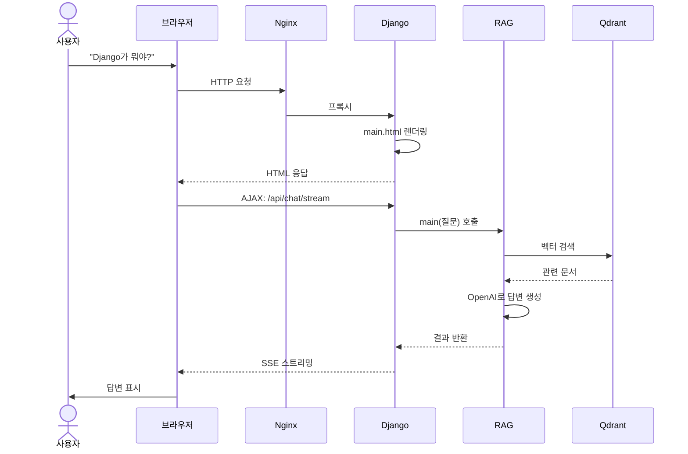

# 🎯 프로젝트 아키텍처 한눈에 보기

> **목표:** Flask 앱 → Django 변환 → EC2 배포

---

## 📊 전체 구조 (5초 요약)

```
┌─────────────┐
│ 👤 사용자    │
└──────┬──────┘
       │ 브라우저로 접속
       ▼
┌─────────────────────────────────────┐
│        AWS EC2 서버 (클라우드)       │
│  ┌─────────────────────────────┐   │
│  │  🐳 Docker 컨테이너들       │   │
│  │                              │   │
│  │  ┌────────────────────────┐ │   │
│  │  │ Nginx (웹 서버)        │ │   │
│  │  └───────┬────────────────┘ │   │
│  │          │                   │   │
│  │  ┌───────▼────────────────┐ │   │
│  │  │ Django (백엔드/프론트) │ │   │
│  │  │  - HTML 템플릿         │ │   │
│  │  │  - Chat API           │ │   │
│  │  │  - Quiz API           │ │   │
│  │  └───────┬────────────────┘ │   │
│  │          │ main() 호출      │   │
│  │  ┌───────▼────────────────┐ │   │
│  │  │ RAG 시스템 (완성됨)    │ │   │
│  │  └───────┬────────────────┘ │   │
│  │          │ 벡터 검색        │   │
│  │  ┌───────▼────────────────┐ │   │
│  │  │ Qdrant (벡터 DB)       │ │   │
│  │  └────────────────────────┘ │   │
│  └─────────────────────────────┘   │
└─────────────────────────────────────┘
```

---

## 👥 팀 역할 분담



**핵심:**
- **세연** = 디자인만 (개발 X)
- **주원** = Django 프로젝트 + 메인 UI
- **경은** = 도움 UI + Quiz API + CSS/JS 전부
- **지용** = EC2 배포 + 정적 파일 설정

---

## 🔄 작업 흐름 (사용자가 질문하면?)



---

## 📁 파일 구조 (3명이 만들 것)

```
SKN21_3rd_4Team/
│
├── 🆕 django_app/          ← 주원·경은·지용이 새로 만듦
│   ├── manage.py
│   │
│   ├── config/             ← 주원
│   │   ├── settings.py
│   │   ├── urls.py
│   │   └── middleware.py   ← 경은
│   │
│   ├── apps/
│   │   ├── chat/           ← 주원 (Chat API)
│   │   ├── quiz/           ← 경은 (Quiz API)
│   │   └── common/         ← 경은 (Health Check)
│   │
│   ├── templates/
│   │   ├── base.html       ← 주원
│   │   ├── main.html       ← 주원 (세연 디자인 참고)
│   │   └── help.html       ← 경은
│   │
│   └── static/
│       ├── css/            ← 경은 (CSS 3개 파일)
│       └── js/             ← 경은 (JS 2개 파일)
│
├── ✅ main.py              ← 완성됨 (건드리지 말 것!)
├── ✅ src/                 ← 완성됨 (RAG 시스템)
├── ✅ data/                ← 완성됨 (강의 자료)
│
├── ✅ deploy/              ← 지용 (이미 완료)
│   ├── Dockerfile
│   ├── docker-compose.yml
│   └── nginx.conf
│
└── ❌ app.py               ← Flask (삭제 예정)
    └── templates/index.html  ← 2177줄 (Django로 분할 예정)
```

---

## 🎨 지금 할 일 (우선순위)

### 1단계: 프로젝트 생성 (주원)
```bash
cd SKN21_3rd_4Team
django-admin startproject config django_app
cd django_app
python manage.py startapp chat
python manage.py startapp quiz
python manage.py startapp common
```

### 2단계: UI 분할 (주원 + 경은)
- **주원**: `index.html` → `base.html` + `main.html`
- **경은**: CSS 추출 → `base.css` + `main.css` + `help.css`
- **경은**: JS 추출 → `chat.js` + `quiz.js`

### 3단계: API 이관 (주원 + 경은)
- **주원**: `app.py`의 Chat API → Django
- **경은**: `app.py`의 Quiz API → Django

### 4단계: 배포 (지용)
```bash
cd deploy
docker-compose up -d
```

---

## ⚡ 핵심 포인트

### ✅ DO (해야 할 것)
- Django에서 `from main import main` 호출
- Flask `app.py` 로직을 Django로 복사
- API 엔드포인트 경로 동일하게 유지
- CSS/JS를 Django `static/` 폴더로 분리

### ❌ DON'T (하지 말아야 할 것)
- `main.py`, `src/` 폴더 **절대 수정 금지**
- API 응답 형식 변경 금지 (프론트엔드 호환성)
- RAG 시스템 내부 로직 건드리지 말 것

---

## 🚀 완성되면?

```
사용자 브라우저 입력:
http://<EC2_IP>/

→ Django가 main.html 렌더링
→ JavaScript가 /api/chat/ 호출
→ Django가 main() 호출
→ RAG 시스템이 답변 생성
→ 브라우저에 스트리밍 응답

✨ 완성! ✨
```

---

## 🆚 변경 전후 비교

| 항목       | 현재 (Flask)     | 목표 (Django)             |
| ---------- | ---------------- | ------------------------- |
| **실행**   | `python app.py`  | `docker-compose up -d`    |
| **접속**   | `localhost:5000` | `http://<EC2_IP>`         |
| **템플릿** | `index.html` 1개 | `base/main/help.html` 3개 |
| **배포**   | 로컬만           | ☁️ AWS EC2 클라우드        |
| **확장성** | 낮음             | 높음 (컨테이너화)         |

---

> **다음 단계:** 주원님이 Django 프로젝트 생성 → 경은님 CSS 분리 → 지용님 배포
